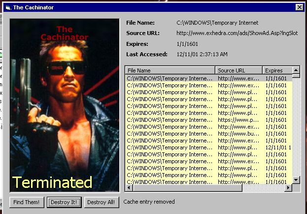



## Cachinator Resub

### Description

Manage Internet Explorer cache with this awesome code module. Find cache entries, enumerate cache entries, DELETE cache entries, it's all in this module. Cachinator is just a front end to demonstrate some uses of it.
 
### More Info
 
huh?

what??

headaches, nausea

             |
---                |---
**Submitted On**   |2001-12-11 11:15:48
**By**             |[eidos](https://github.com/Planet-Source-Code/PSCIndex/blob/master/ByAuthor/eidos.md)
**Level**          |Intermediate
**User Rating**    |4.3 (13 globes from 3 users)
**Compatibility**  |VB 5\.0, VB 6\.0
**Category**       |[Windows API Call/ Explanation](https://github.com/Planet-Source-Code/PSCIndex/blob/master/ByCategory/windows-api-call-explanation__1-39.md)
**World**          |[Visual Basic](https://github.com/Planet-Source-Code/PSCIndex/blob/master/ByWorld/visual-basic.md)
**Archive File**   |[Cachinator4112512112001\.zip](https://github.com/Planet-Source-Code/eidos-cachinator-resub__1-29669/archive/master.zip)

### API Declarations

lots of em

